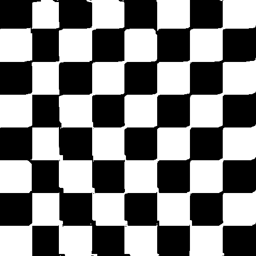

# MaterialReconstruction.jl

`MaterialReconstruction.jl` package can be used to recreate binary arrays (also
called two-phase systems in this documentation) from a set of descriptors known
as correlation functions using a technique called simulated annealing. It works
in conjunction with packages `CorrelationFunctions.jl` and
`CorrelationsTrackers.jl`.

This package is quite configurable which means you can decide which correlation
functions to take into account, which cooldown schedule to use etc.

Look at this minimal example to see how `MaterialReconstruction.jl` can be used:

```@example
using CorrelationFunctions
using CorrelationTrackers
using MaterialReconstruction
using Images
using FileIO
using Random

Random.seed!(123)
# Load a binary array we want to reconstruct
array = load("images/value-noise.png") .|> Bool
# Choose correlation functions we want to track (S2 for void phase, L2 for both phases)
functions = [S2Tracker(false), L2Tracker(false), L2Tracker(true)]
# Create an instance of CorrelationTracker type. Correlation functions are calculated
# with periodic boundary conditions.
target = CorrelationTracker(array; tracking = functions, periodic = true)

# Initialize an array to be reconstructed
system = initialize_spheres(target)
# Create an instance of Furnace. T0 is an initial temperature
furnace = Furnace(system, target; T0 = 2e-5)
# Choose a cost function.
# (More about Čapek cost function in the section "Cost functions")
cost = čapek_cost(system, target, 0.4)
# Choose a modifier (more in the section "Samplers and modifiers")
modifier = Flipper(InterfaceSampler())
# Choose a cooldown schedule (more in the section "Cooldown schedules")
cooldown = aarts_korst_cooldown(n = 100, λ = 0.01)

# Measure initial value of the cost function
cost1 = cost(target, system)

# This is a kludge used to work around impossibility of reassigning a variable
# in the loop in examples generated by Documenter.jl
function annealing_step!(f)
    f[] = annealing_step(f[];
                         cost     = cost,
                         modifier = modifier,
                         cooldown = cooldown)
end

# Run 5000 annealing steps. Usually you have to repeat this loop a few million times.
f = Ref(furnace)
for i in 1:5000
    annealing_step!(f)
end

# Measure final value of the cost function
cost2 = cost(target, system)
cost1, cost2
```

As you see, the cost function decreases after 5000 iterations of the
process. More illustrative examples are in the section [Examples](@ref).
Each aspect of `MaterialReconstruction.jl` API is described in a dedicated
section.

## Cost functions

Cost functions are the functions which are minimized during simulated
annealing. Usually, we have two binary arrays, one of them is fixed (the target
array) and the other is changed during annealing. An annealing process stops
when the value of the cost function becomes small enough which means two arrays
are "similar" to each other. A cost function takes two `CorrelationTracker`
objects (which are our arrays + a set of correlation functions calculated for
those arrays) and returns a real number which specifies how similar those
arrays are. Usually, this similarity is measured by comparing the values of
correlation functions. The following cost functions are defined in this package:

```@docs
euclid_mean
euclid_directional
euclid_mean_weighted
euclid_directional_weighted
čapek_cost
generalized_čapek_cost
```

## Initialization

Before running simulated annealing, you must begin with some initial
state. The following functions serve for creation of such state. An optional
`shape` argument can be given to all of these functions to initialize array with
a shape which is different from `target`'s.

```@docs
initialize_random
initialize_spheres
```

## Samplers and modifiers

Simulated annealing works by taking a random sample (or a few) from an array to
be reconstructed, modifying it (them) and either accepting the modification or
rejecting it. You can choose how exactly sampling and modification steps are
performed by choosing one of existent `AbstractModifier` and `AbstractSampler`
types or writing your own.

### Samplers

Samplers are subtypes of `AbstractSampler`. They define how exactly a sample to
be modified is chosen. There are three samplers in this package:

```@docs
UniformSampler
InterfaceSampler
DPNSampler
```

You can also write your own sampler type which must be a subtype of
`AbstractSampler` and implement the following interface:

| Function name   | Optional? | Default definition
|-----------------|-----------|-------------------
| `update_pre!`   | Yes       | `nothing`
| `update_post!`  | Yes       | `nothing`
| `sample`        | No        |

The first two functions must only be implemented if you sampler has some state
which must be updated when a reconstructed array is changed.

```@docs
AbstractSampler
update_pre!
update_post!
sample
```

### Modifiers

Modifier types are subtypes of `AbstractModifier`. They define how to modify
samples returned from `sample` function. `MaterialReconstruction.jl` provides
two modifier types:

```@docs
Flipper
Swapper
```

You can also implement your own modifier type subtyping `AbstractModifier` and
implementing two methods: `modify!` and `reject!`.

```@docs
AbstractModifier
modify!
reject!
```

## Cooldown schedules

When a modification to a reconstructed array results in increase of the cost
function a decision to either accept or reject that modification is taken
according to the parameter called "temperature". The higher the temperature the
higher the probability that the change is accepted. After each accepted
modification the temperature decreases according to the cooldown schedule. There
are three predefined schedules in `MaterialReconstruction.jl`:

```@docs
exponential_cooldown
aarts_korst_cooldown
frost_heineman_cooldown
```

## Annealing

When an array you wish to reconstruct is initialized, a cooldown schedule, a
cost function and a modifier are chosen, you must create an object of type
`Furnace` and run `annealing_step` function many times until the cost function
returns a value small enough to consider that two arrays have the same values of
correlation functions.

```@docs
Furnace
annealing_step
```

## Examples

All following examples are reconstructed from two-point and lineal-path
functions calculated in axial and diagonal directions.

### Value noise (small details)

|   Original  |  Reconstruction  |
|-------------|------------------|
|  |  |

### Value noise (big details)

|   Original  |  Reconstruction  |
|-------------|------------------|
|  |  |

### Checkboard

|   Original  |  Reconstruction  |
|-------------|------------------|
|  |  |

### Sample from digitalrocksportal.org

|   Original  |  Reconstruction  |
|-------------|------------------|
|  |  |
